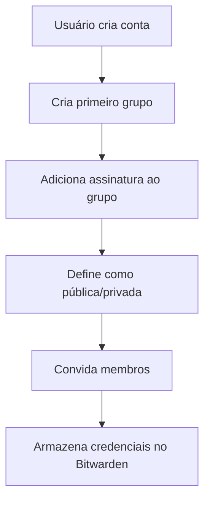
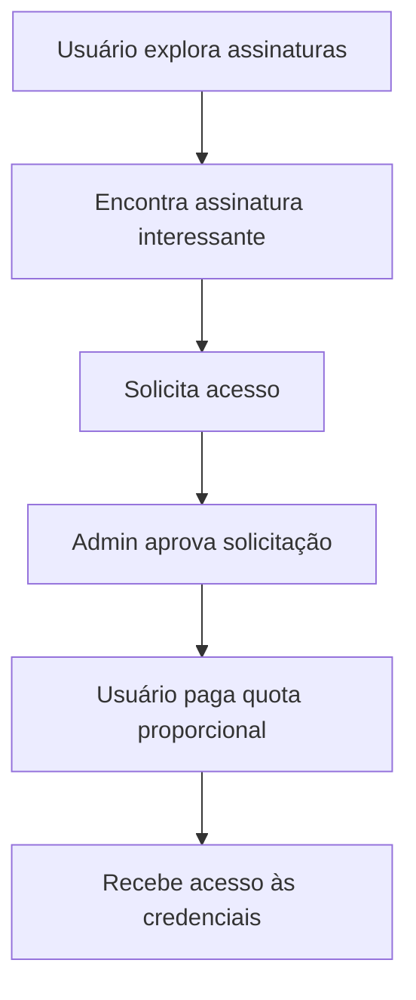

# 🎯 Carteira - Sistema de Compartilhamento de Assinaturas

Uma plataforma moderna para compartilhar de forma segura assinaturas de streaming e serviços digitais, construída com Next.js, React Native e integração com Bitwarden.

## 🌟 Visão Geral

O Carteira permite que usuários:
- 📺 Compartilhem assinaturas de serviços como Netflix, Spotify, etc.
- 💰 Economizem dinheiro dividindo custos com pessoas de confiança
- 🔐 Mantenham credenciais seguras através da integração com Bitwarden
- 👥 Gerenciem grupos e convites de forma organizada
- 📊 Acompanhem economia e histórico financeiro
- 🔔 Recebam notificações sobre renovações e pagamentos

## 🏗️ Arquitetura

### Stack Tecnológica

- **Frontend Web**: Next.js 14, TypeScript, Tailwind CSS
- **Mobile**: React Native, Expo, NativeWind
- **Backend**: Next.js API Routes, Drizzle ORM
- **Banco de Dados**: PostgreSQL (Supabase)
- **Autenticação**: JWT personalizado
- **Segurança**: Integração com Bitwarden
- **Deploy**: Vercel (Web), EAS (Mobile)

### Funcionalidades Implementadas

✅ **Sistema de Autenticação**
- Cadastro e login com JWT
- Middleware de autenticação
- Logs de auditoria

✅ **Gestão de Grupos**
- Criação e gerenciamento de grupos
- Sistema de convites por email
- Controle de membros e permissões

✅ **Compartilhamento de Assinaturas**
- Assinaturas públicas e privadas
- Descoberta de assinaturas disponíveis
- Solicitação e aprovação de acesso
- Gerenciamento de membros

✅ **Segurança de Credenciais**
- Integração completa com Bitwarden
- Armazenamento seguro de senhas
- Rotação automática de credenciais
- Logs de acesso para auditoria

✅ **Sistema Financeiro**
- Dashboard com métricas de economia
- Histórico de pagamentos
- Cálculo automático de custos por pessoa
- Relatórios financeiros detalhados

✅ **Notificações Inteligentes**
- Alertas de renovação próxima
- Notificações de pagamentos
- Lembretes de troca de senha
- Sistema de automação via cron jobs

✅ **Interface Mobile Completa**
- App nativo com React Native
- Navegação por tabs
- Todas as funcionalidades do web
- Design responsivo

## 🚀 Início Rápido

### Pré-requisitos

```bash
# Node.js 18+
node --version

# pnpm
npm install -g pnpm

# Git
git --version
```

### Instalação

```bash
# Clone o repositório
git clone <repository-url>
cd dividee

# Instale as dependências
pnpm install

# Configure as variáveis de ambiente
cp apps/web/.env.example apps/web/.env.local
cp apps/mobile/.env.example apps/mobile/.env.local

# Execute as migrações do banco
cd apps/web
pnpm run db:push

# Inicie os servidores de desenvolvimento
cd ../..
pnpm dev
```

### URLs de Desenvolvimento

- **Web**: http://localhost:3000
- **Mobile**: Expo Dev Tools em http://localhost:8081

## 📱 Principais Funcionalidades

### Dashboard Financeiro
- Visão geral dos gastos e economia
- Métricas de performance por assinatura
- Projeções de economia futura

### Exploração de Assinaturas
- Busca por assinaturas públicas
- Filtros por preço, serviço e disponibilidade
- Solicitação de acesso simplificada

### Gestão de Grupos
- Criação e administração de grupos
- Sistema de convites via email
- Controle de permissões (owner/admin/membro)

### Segurança Avançada
- Integração com Bitwarden para credenciais
- Logs de auditoria completos
- Notificações de segurança

## 🎯 Fluxos de Usuário

### 1. Criação de Grupo e Assinatura


### 2. Participação em Assinatura


## 🔧 Desenvolvimento

### Estrutura do Projeto

```
dividee/
├── apps/
│   ├── web/                 # Next.js web application
│   │   ├── src/
│   │   │   ├── app/         # App Router (pages + API)
│   │   │   ├── lib/         # Utilities (DB, auth, etc.)
│   │   │   └── hooks/       # React hooks
│   │   └── drizzle/         # Database migrations
│   └── mobile/              # Expo mobile application
│       ├── src/
│       │   ├── screens/     # App screens
│       │   ├── navigation/  # Navigation setup
│       │   └── services/    # API services
│       └── assets/          # Images and icons
├── DEPLOY_INSTRUCTIONS.md   # Deploy guide
├── PRODUCT_DOCUMENTATION.md # Product specs
└── plan.md                 # Development plan
```

### Comandos Úteis

```bash
# Desenvolvimento
pnpm dev                     # Inicia web + mobile
pnpm dev:web                 # Apenas web
pnpm dev:mobile              # Apenas mobile

# Banco de dados
pnpm db:generate             # Gera migrações
pnpm db:migrate              # Executa migrações
pnpm db:push                 # Push direto (dev only)
pnpm db:studio               # Interface visual do DB

# Build
pnpm build                   # Build completo
pnpm build:web               # Build apenas web
pnpm build:mobile            # Build mobile

# Testes e Qualidade
pnpm lint                    # Linting
pnpm type-check              # TypeScript check
```

### APIs Principais

| Endpoint | Método | Descrição |
|----------|--------|-----------|
| `/api/auth/login` | POST | Autenticação |
| `/api/subscriptions/public` | GET | Assinaturas públicas |
| `/api/groups` | GET/POST | Gestão de grupos |
| `/api/credentials/{id}` | GET/PUT | Credenciais do Bitwarden |
| `/api/dashboard/financial` | GET | Métricas financeiras |
| `/api/notifications/automation` | POST | Automação |

## 🚀 Deploy em Produção

Para instruções completas de deploy, consulte [DEPLOY_INSTRUCTIONS.md](./DEPLOY_INSTRUCTIONS.md).

### Resumo do Deploy

1. **Banco de Dados**: Supabase PostgreSQL
2. **Backend**: Vercel (Next.js)
3. **Mobile**: EAS Build + App Stores
4. **Segurança**: Bitwarden Business Account

### Variáveis de Ambiente Necessárias

```bash
# Database
DATABASE_URL=postgresql://...

# Supabase
NEXT_PUBLIC_SUPABASE_URL=https://...
NEXT_PUBLIC_SUPABASE_ANON_KEY=...

# JWT & Security
JWT_SECRET=...
AUTOMATION_SECRET=...

# Bitwarden
BITWARDEN_CLIENT_ID=...
BITWARDEN_CLIENT_SECRET=...
BITWARDEN_API_URL=https://api.bitwarden.com
```

## 📊 Métricas e Monitoramento

### KPIs Implementados
- Taxa de conversão de solicitações
- Tempo médio de aprovação
- Economia média por usuário
- Retenção de membros
- Crescimento de grupos ativos

### Logs de Auditoria
- Acesso a credenciais
- Alterações de senha
- Adição/remoção de membros
- Criação de grupos e assinaturas

## 🔒 Segurança

### Medidas Implementadas
- ✅ Autenticação JWT
- ✅ Integração Bitwarden para credenciais
- ✅ Logs de auditoria completos
- ✅ Middleware de autenticação
- ✅ Validação de entrada (Zod)
- ✅ Rate limiting (Next.js)

### Roadmap de Segurança
- [ ] Autenticação de dois fatores (2FA)
- [ ] Criptografia adicional para dados sensíveis
- [ ] Análise de comportamento anômalo
- [ ] Compliance LGPD/GDPR

## 🗺️ Roadmap

### Próximas Funcionalidades
- [ ] Sistema de pagamentos automáticos
- [ ] Notificações push mobile
- [ ] Integração com PIX
- [ ] Sistema de reviews/avaliações
- [ ] Analytics avançados
- [ ] API pública para parceiros

### Melhorias Técnicas
- [ ] Cache Redis
- [ ] CDN para assets
- [ ] Monitoramento APM
- [ ] Testes automatizados E2E
- [ ] CI/CD completo

## 🤝 Contribuição

### Guidelines
1. Fork o repositório
2. Crie uma branch feature (`git checkout -b feature/amazing-feature`)
3. Commit suas mudanças (`git commit -m 'Add amazing feature'`)
4. Push para a branch (`git push origin feature/amazing-feature`)
5. Abra um Pull Request

### Standards
- TypeScript obrigatório
- ESLint + Prettier para formatação
- Conventional Commits
- Testes para funcionalidades críticas

## 📄 Documentação Adicional

- [DEVELOPMENT.md](./DEVELOPMENT.md) - Setup de desenvolvimento
- [DEPLOY_INSTRUCTIONS.md](./DEPLOY_INSTRUCTIONS.md) - Deploy completo
- [PRODUCT_DOCUMENTATION.md](./PRODUCT_DOCUMENTATION.md) - Especificações do produto
- [plan.md](./plan.md) - Plano de desenvolvimento

## 📝 Licença

Este projeto está licenciado sob a licença MIT. Veja o arquivo [LICENSE](./LICENSE) para detalhes.

## 🆘 Suporte

- 📧 Email: suporte@carteira.app
- 📱 Telegram: @carteira_suporte
- 🐛 Issues: [GitHub Issues](../../issues)
- 📖 Docs: [Documentação Completa](./docs/)

---

**Carteira v0** - Desenvolvido com ❤️ para democratizar o acesso a serviços digitais através do compartilhamento inteligente.